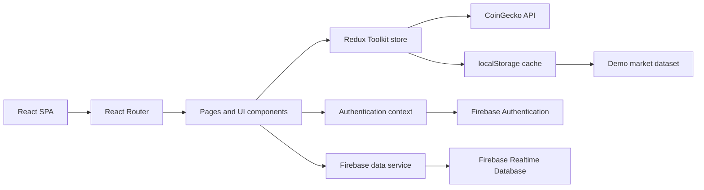

# CryptPulse

[](https://react.dev/)
[](https://redux-toolkit.js.org/)
[](https://firebase.google.com/)
[](https://www.netlify.com/)


A responsive crypto market dashboard and simulated trading workspace built to make market discovery, portfolio tracking, and account activity understandable in one interface.

> [!IMPORTANT]
> CryptPulse simulates trading and wallet activity. It does not execute real trades,
> custody assets, or process payments. Never enter real payment-card details.

---

## Overview

CryptPulse presents live cryptocurrency market data alongside a Firebase-backed
account experience. Visitors can inspect market prices and trends; authenticated
users can maintain a simulated USD balance, open or close positions, review
transactions, and manage demo funding methods.

The project targets people exploring crypto market interfaces and developers
studying a complete React/Firebase application. It is a browser-only single-page
application: React renders the UI, Redux Toolkit manages market state, CoinGecko
provides public market data, and Firebase supplies authentication and per-user
Realtime Database storage.

Market requests degrade safely from live data to a local cache and then to a
deterministic demo dataset, keeping the interface usable during API outages or
rate limiting.

## Features

### Markets

- [x] Live top-50 cryptocurrency market table
- [x] Asset search, sorting, market summaries, and trending views
- [x] High-contrast SVG price sparklines and one-day asset charts
- [x] Responsive layouts for desktop, tablet, and mobile screens
- [x] Live, cached, and demo market-data states
- [x] Null-safe normalization and formatting for incomplete API responses

### Accounts and Portfolio

- [x] Email/password registration and sign-in with Firebase Authentication
- [x] Authenticated portfolio overview and open-position tracking
- [x] Simulated buy and sell orders
- [x] Transaction history and account-flow summaries
- [x] Simulated wallet funding and funding-method management
- [x] Atomic Firebase transactions for balance and position updates

### Product Experience

- [x] Dark, neon-accented trading interface
- [x] Market brief and crypto intelligence pages
- [x] Authenticated support flow
- [x] Client-side routing with SPA fallback and custom error handling

## Tech Stack

| Area | Technologies |
| --- | --- |
| Frontend | React 18, React Router 6, CSS Modules, custom SVG charts |
| State | Redux Toolkit, React Context, browser `localStorage` cache |
| Data | CoinGecko REST API, deterministic local fallback data |
| Authentication | Firebase Authentication |
| Database | Firebase Realtime Database |
| Testing | Jest, React Testing Library, `jest-dom` |
| Tooling | Create React App, npm, ESLint configuration from `react-scripts` |
| Deployment | Netlify static hosting, Firebase CLI configuration |

## Architecture

The application separates page-level route components from reusable UI,
state-management, data-normalization, and Firebase service code.



- **Folder structure:** route-level features live under domain folders such as
  `Exchange/`, `Profile/`, and `Wallet/`; reusable presentation components live
  under `UI/`.
- **API flow:** Redux async thunks request CoinGecko data, validate responses,
  normalize nullable fields, cache successful payloads, and select cached or demo
  data when requests fail.
- **Database interaction:** `src/firebase.js` owns user records, listeners, wallet
  operations, and atomic simulated trade transactions.
- **Authentication:** Firebase Authentication state is exposed through a React
  context. Authenticated routes redirect anonymous users to `/profile`.
- **State management:** Redux stores market and transaction state; React context
  stores authentication state; component state handles local forms and dialogs.

## Screenshots

Screenshots have not yet been committed. The following paths are reserved so they
can be added without changing this document:


## Installation

### Prerequisites

- Node.js and npm. **TODO:** define and enforce the supported Node.js version in
  `package.json`.
- A modern browser with JavaScript and `localStorage` enabled.

### Setup

```bash
git clone https://github.com/06bisik03/CryptPulse.git
cd CryptPulse
npm ci
npm start
```

Open [http://localhost:3000](http://localhost:3000). The development server reloads
when source files change.

Create an optimized production bundle with:

```bash
npm run build
```

The static output is written to `build/`.

## Environment Variables

The current application does not read environment variables. CoinGecko endpoints
and the Firebase web configuration are defined in source code.

| Variable | Description | Required |
| --- | --- | :---: |
| None | No runtime environment variables are currently consumed. | No |

**TODO:** move deployment-specific Firebase configuration from `src/firebase.js`
to Create React App-compatible `REACT_APP_*` variables before introducing
additional environments.

## Usage

1. Open `/exchange` to browse assets, search by name or ticker, and sort the market
   table.
2. Select an asset to inspect its recent price line, market statistics, and order
   ticket.
3. Open `/profile` to create an account or sign in with email and password.
4. Use `/wallet` to add a **demo-only** funding method and increase the simulated
   USD reserve.
5. Submit simulated buy or sell orders from an asset page or the portfolio.
6. Review positions, cash flow, and transaction history from `/profile`.

Public market browsing works without an account. Wallet, portfolio, and support
features require authentication.

## External API

CryptPulse has no first-party HTTP backend. The browser calls the public
CoinGecko API directly.

Base URL: `https://api.coingecko.com/api/v3`

| Method | Route | Purpose |
| --- | --- | --- |
| `GET` | `/coins/markets` | Ranked market data, prices, changes, and sparklines |
| `GET` | `/global` | Aggregate cryptocurrency market statistics |
| `GET` | `/coins/:id/market_chart` | One-day price history for an asset detail page |

Requests are subject to CoinGecko availability and public rate limits. Failed
market-list requests automatically use cached or bundled demo data.

## Project Structure

```text
CryptPulse/
├── public/                  # Static assets and web app metadata
├── src/
│   ├── Contact/             # Authenticated support flow
│   ├── Exchange/            # Market lists, filters, briefs, and asset routes
│   ├── Mentoring/           # Crypto intelligence and curriculum pages
│   ├── Profile/             # Authentication and portfolio pages
│   ├── Store/               # Authentication context and legacy data helpers
│   ├── UI/                  # Shared presentation components
│   ├── Wallet/              # Simulated funding and wallet management
│   ├── WelcomePage/         # Public landing page
│   ├── data/                # Deterministic fallback market data
│   ├── hooks/               # Polling, navigation, and calculation hooks
│   ├── redux/               # Store, slices, and CoinGecko async thunks
│   ├── utils/               # Market normalization and safe formatters
│   ├── App.js               # Route configuration
│   ├── firebase.js          # Firebase initialization and data operations
│   └── index.js             # React application entry point
├── database.rules.json      # Per-user Realtime Database authorization rules
├── firebase.json            # Firebase rules and emulator configuration
├── netlify.toml             # Netlify build and SPA redirect configuration
└── package.json             # Dependencies and npm scripts
```

## Development

| Task | Command | Notes |
| --- | --- | --- |
| Development server | `npm start` | Runs the app at `http://localhost:3000` |
| Tests | `npm test` | Starts Jest in watch mode |
| One test run | `npm test -- --watchAll=false` | Suitable for local verification or CI |
| Production build | `npm run build` | Creates the optimized `build/` directory |
| Lint | `npm start` or `npm run build` | CRA runs its ESLint checks; no standalone script exists |
| Format | TODO | No formatter is currently configured |

Do not run `npm run eject` unless the repository is intentionally leaving Create
React App; the operation is irreversible.

## Testing

Tests use Jest through `react-scripts`, with React Testing Library available for
component tests. The current automated suite focuses on market-data resilience:

- nullable API values are converted to finite values;
- invalid responses select deterministic fallback assets;
- currency and percentage formatters remain safe for missing values.

```bash
npm test -- --watchAll=false
```

**TODO:** add interaction coverage for authentication, wallet funding, and trade
transactions using Firebase emulators.

## Deployment

### Netlify

`netlify.toml` configures the production build command, output directory, and SPA
route fallback:

```toml
[build]
  command = "npm run build"
  publish = "build"
```

Connect the repository to Netlify and deploy `main`. Netlify will install npm
dependencies, run the production build, publish `build/`, and route unknown paths
back to `index.html` for React Router.

### Firebase

`firebase.json` configures Authentication and Realtime Database emulators, while
`database.rules.json` restricts each user record to its authenticated owner.

**TODO:** add a repository-specific Firebase project alias and document the rules
deployment command before automating Firebase deployments.

## Performance

- Successful market responses are cached in `localStorage`.
- Market data refreshes every two minutes and trending data every ten minutes.
- Polling pauses while the document is not visible.
- Lightweight SVG and CSS visuals avoid runtime chart rendering overhead for the
  primary market table.
- Production builds are minified and content-hashed by Create React App.

Route-level lazy loading is not currently implemented.

## Security

- Firebase Authentication manages user identity and persisted sessions.
- Realtime Database rules deny global access and limit each `/users/$uid` record
  to the matching authenticated user.
- Buy, sell, and wallet-funding mutations use Realtime Database transactions to
  avoid partial balance updates.
- Numeric transaction inputs are checked before database writes.
- Client-side route guards improve navigation but are not an authorization
  boundary; Firebase rules remain the enforcement layer.
- No first-party backend exists, so application-level rate limiting is not
  implemented.

> [!WARNING]
> The demo wallet currently stores full card numbers and metadata in Firebase.
> It is not PCI DSS compliant and must not be used with real cardholder data. A
> production payment flow must use tokenization through a compliant provider and
> must never persist raw card numbers or security codes.

Do not commit private service-account credentials, Firebase Admin keys, or `.env`
files. Firebase web configuration identifies a project but does not replace
Authentication and Realtime Database authorization rules.

## Roadmap

- [x] Responsive market dashboard and asset detail pages
- [x] Firebase email/password authentication
- [x] Simulated portfolio, transactions, and wallet funding
- [x] Resilient live/cache/demo market-data pipeline
- [ ] Replace the demo card workflow with a tokenized payment integration or
      remove payment-card input
- [ ] Move deployment configuration to environment variables
- [ ] Add route-level code splitting
- [ ] Add Firebase emulator integration tests and continuous integration
- [ ] Add repository screenshots
- [ ] Select and add an open-source license

## Contributing

1. Fork the repository and create a focused branch from `main`.
2. Install the locked dependency graph with `npm ci`.
3. Keep UI changes responsive and preserve null-safe market-data handling.
4. Add or update tests for behavioral changes.
5. Run `npm test -- --watchAll=false` and `npm run build`.
6. Open a pull request describing the problem, approach, and verification steps.

Do not include real user, card, or Firebase production data in issues, fixtures,
screenshots, or pull requests.

## License

**TODO:** No license file is currently present. Add a license before distributing
or accepting external contributions.

## Author

**Barış Ekin IŞIK**

- GitHub: [@06bisik03](https://github.com/06bisik03)
- Portfolio: TODO
- LinkedIn: TODO

## Acknowledgements

- [CoinGecko](https://www.coingecko.com/en/api) for public cryptocurrency market
  data.
- [Firebase](https://firebase.google.com/) for Authentication and Realtime
  Database services.
- [React](https://react.dev/) and
  [Redux Toolkit](https://redux-toolkit.js.org/) for the application and state
  architecture.
